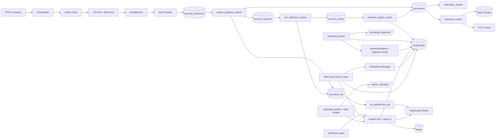
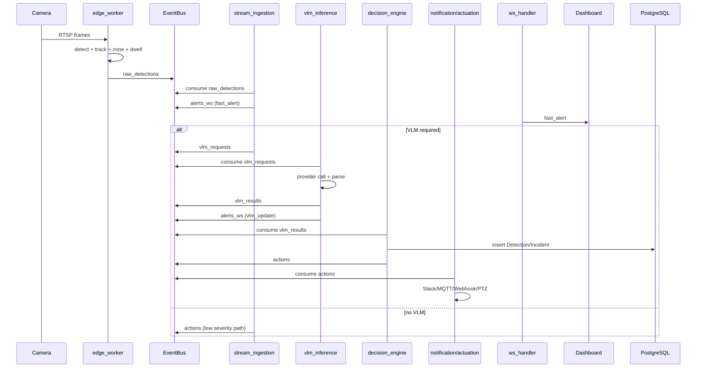
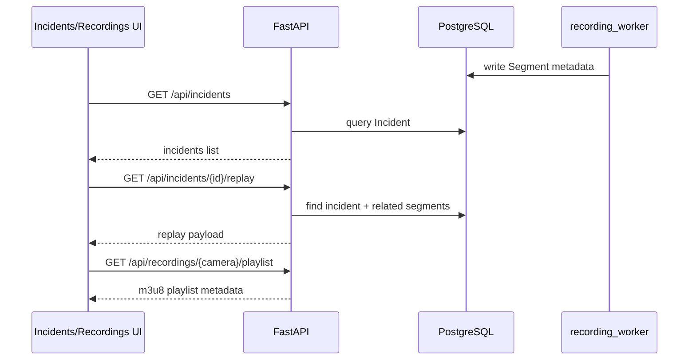
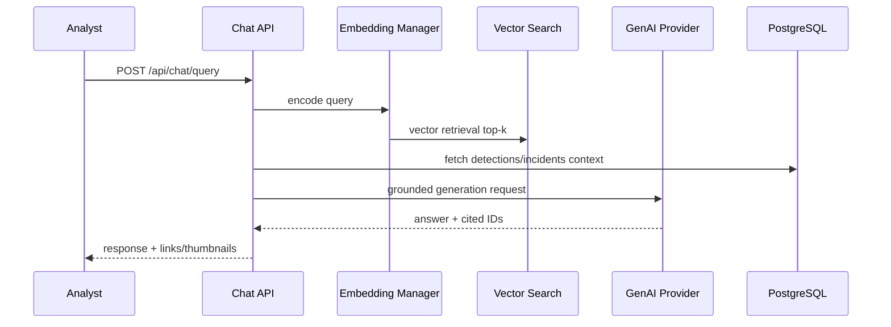

# ArgusV Complete System Flow Diagram

This document describes architecture and execution flows for full project scope.

## 1) Full Architecture

## 2) Real-Time Alert Sequence

## 3) Incident and Replay Sequence

## 4) RAG/Chat Sequence (Planned Scope)

## 5) Implementation Critical Path

1. Mount `src/api/routes/*` into `src/api/server.py`.
2. Complete `recording_worker` DB write + segment linking path.
3. Implement auth in `src/auth/jwt_handler.py` and protect APIs.
4. Finish `zones`, `incidents`, `recordings` route handlers.
5. Complete observability path (`/api/stats`, `/metrics`) and watchdog automation.
