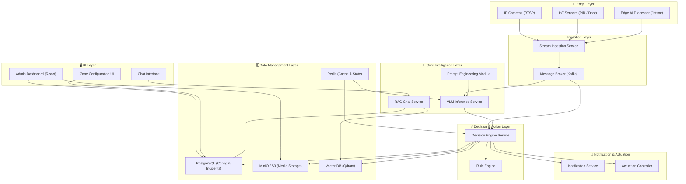
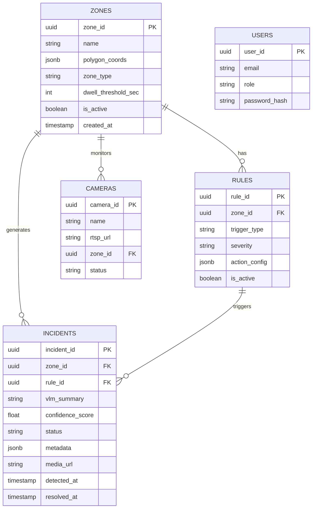
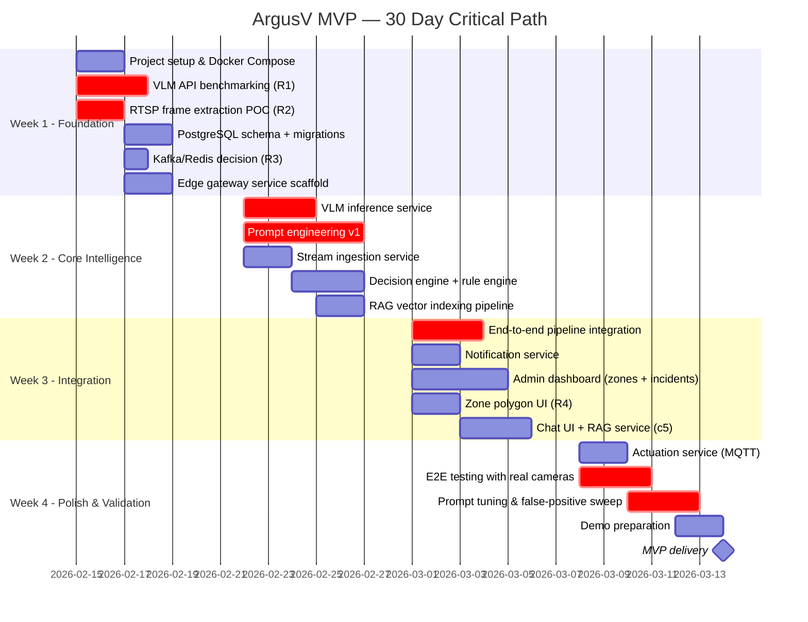

# ArgusV — Engineering Plan: Intelligent Vision Security System MVP

> **Project:** ArgusV — Intelligent Loitering & Trespassing Deterrence  
> **Sprint:** 30-Day MVP  
> **Date:** February 14, 2026

---

## 1. Executive Summary

ArgusV is an intelligent vision security system that combines real-time video surveillance with Vision Language Model (VLM) reasoning to detect, interpret, and respond to security events such as loitering and trespassing. This engineering plan defines the **microservice architecture**, **data management layer**, **definitive tech stack**, **trial-and-error zones**, **research areas**, **critical paths**, and a phased **integration plan** to deliver a functional MVP within 30 days.

---

## 2. System Architecture Overview



---

## 3. Microservice Decomposition

Each microservice is independently deployable, containerized (Docker), and communicates via REST APIs and Kafka event streams.

### 3.1 `edge-gateway-service`

| Attribute | Detail |
|:---|:---|
| **Responsibility** | Receive RTSP streams, run lightweight object detection (YOLOv8-nano), emit detection events |
| **Runtime** | Python 3.11 on NVIDIA Jetson / x86 GPU host |
| **Key Libraries** | `ultralytics`, `opencv-python`, DeepStream SDK (optional) |
| **Inputs** | RTSP video feeds, MQTT sensor events |
| **Outputs** | Detection events (person detected, zone entry) → Kafka topic `raw-detections` |
| **Port** | `8001` |

### 3.2 `stream-ingestion-service`

| Attribute | Detail |
|:---|:---|
| **Responsibility** | Ingest detection events, extract & buffer key frames, enrich with metadata, forward to VLM |
| **Runtime** | Python 3.11 (FastAPI) |
| **Key Libraries** | `confluent-kafka`, `Pillow`, `boto3` (MinIO SDK) |
| **Inputs** | Kafka topic `raw-detections` |
| **Outputs** | Enriched payloads → Kafka topic `vlm-requests`; frames → MinIO |
| **Port** | `8002` |

### 3.3 `vlm-inference-service`

| Attribute | Detail |
|:---|:---|
| **Responsibility** | Accept enriched frames + context, invoke VLM for reasoning, return structured analysis |
| **Runtime** | Python 3.11 (FastAPI) |
| **Key Libraries** | `openai` SDK (for GPT-4o), `httpx`, NVIDIA Triton client (for Cosmos) |
| **Inputs** | Kafka topic `vlm-requests` |
| **Outputs** | Structured JSON analysis → Kafka topic `vlm-results` |
| **Port** | `8003` |
| **GPU** | Required — NVIDIA T4/A10G minimum |

### 3.4 `decision-engine-service`

| Attribute | Detail |
|:---|:---|
| **Responsibility** | Consume VLM results, apply rule engine logic, determine response actions, log incidents |
| **Runtime** | Python 3.11 (FastAPI) |
| **Key Libraries** | `sqlalchemy`, `pydantic`, custom rule engine |
| **Inputs** | Kafka topic `vlm-results`, PostgreSQL (zone configs & rules) |
| **Outputs** | Action commands → Kafka topic `actions`; incident records → PostgreSQL |
| **Port** | `8004` |

### 3.5 `notification-service`

| Attribute | Detail |
|:---|:---|
| **Responsibility** | Deliver multi-channel alerts (email, SMS, Slack, push) with media attachments |
| **Runtime** | Python 3.11 (FastAPI) |
| **Key Libraries** | `twilio`, `slack-sdk`, `sendgrid`, `httpx` |
| **Inputs** | Kafka topic `actions` (alert-type actions) |
| **Outputs** | Notifications to external channels |
| **Port** | `8005` |

### 3.6 `actuation-service`

| Attribute | Detail |
|:---|:---|
| **Responsibility** | Control physical IoT devices — sirens, floodlights, door locks, voice-down speakers |
| **Runtime** | Python 3.11 (FastAPI) |
| **Key Libraries** | `paho-mqtt`, device-specific SDKs |
| **Inputs** | Kafka topic `actions` (actuation-type actions) |
| **Outputs** | MQTT commands to IoT devices |
| **Port** | `8006` |

### 3.7 `rag-chat-service` (New)

| Attribute | Detail |
|:---|:---|
| **Responsibility** | Handle natural language queries about past events, retrieve relevant incident vectors, generate answers |
| **Runtime** | Python 3.11 (FastAPI) |
| **Key Libraries** | `langchain`, `qdrant-client`, `openai` (for chat completion & embeddings) |
| **Inputs** | REST API query from Chat UI |
| **Outputs** | Streaming text response with cited incident IDs |
| **Port** | `8007` |

### 3.8 `admin-dashboard` (Frontend)

| Attribute | Detail |
|:---|:---|
| **Responsibility** | Zone configuration, rule management, incident review, live feed viewer, **AI Chat Interface** |
| **Runtime** | Node.js 20 (React + Vite) |
| **Key Libraries** | React 18, Leaflet.js, Video.js, Ant Design, **shadcn/ui (Chat)** |
| **Interfaces** | REST calls to `decision-engine-service`, `rag-chat-service`, WebSocket for live alerts |
| **Port** | `3000` |

---

## 4. Data Management Layer

### 4.1 Database Architecture



### 4.2 Storage Strategy

| Store | Technology | Purpose | Retention |
|:---|:---|:---|:---|
| **Relational DB** | PostgreSQL 16 | Zone configs, rules, incidents, users | Persistent |
| **Object Storage** | MinIO (S3-compatible) | Video clips, key frames, VLM analysis snapshots | 30 days rolling |
| **Cache / State** | Redis 7 | Active zone states, dwell timers, VLM request dedup | TTL-based (5 min) |
| **Vector DB** | Qdrant | Stores embeddings of incident summaries + metadata | Persistent |
| **Message Bus** | Apache Kafka | Inter-service event streaming | 24-hour retention |

### 4.3 Data Flow Pipeline

```
Camera Frame → Edge Detection → Kafka[raw-detections]
    → Stream Ingestion (frame extraction + metadata enrichment + MinIO upload)
    → Kafka[vlm-requests]
    → VLM Inference (reasoning + structured output)
    → Kafka[vlm-results]
    → Decision Engine (rule matching + incident logging to PostgreSQL)
    → Asynchronously: Generate Embedding of VLM Summary → Upsert to Qdrant
    → Kafka[actions]
    → Notification Service | Actuation Service
```

    → Kafka[actions]
    → Notification Service | Actuation Service
```

---

## 5. Video Streaming Architecture (RTSP → HLS) 📹

To enable low-latency live viewing in the browser (which doesn't natively support RTSP), we will implement a dedicated streaming pipeline.

### 5.1 Technology Selection
We will use **MediaMTX (formerly rtsp-simple-server)** as a lightweight, zero-dependency RTSP-to-HLS proxy. It is more reliable and lower latency than a custom FFmpeg wrapper.

### 5.2 HLS Configuration for Low Latency
Standard HLS has 10–30s latency. We must tune it for security (3–5s latency).

```yaml
# mediamtx.yml
paths:
  all:
    source: rtsp://camera-ip:554/stream
    runOnDemand: no
    hlsMuxer: ffmpeg
    hlsVariant: lowLatency  # Critical for <5s delay
    hlsSegmentCount: 3      # Keep playlist short
    hlsSegmentDuration: 1s  # Small segments = lower latency
    hlsPartDuration: 200ms  # LL-HLS support
```

### 5.3 Pipeline Data Flow
1.  **Camera**: Streams `rtsp://<ip>/live` (H.264).
2.  **MediaMTX Service**: 
    -   Connects to camera RTSP.
    -   Transmuxes (no re-encoding) to HLS segments (`.ts` / `.m4s`).
    -   Serves `http://<host>:8888/cam1/index.m3u8`.
3.  **Frontend (React)**:
    -   `Video.js` player requests `index.m3u8`.
    -   Browser fetches segments and plays.

### 5.4 Backend Service: `stream-service` (Wrapper)
While MediaMTX handles the core streaming, our `stream-service` (Python) wraps it to:
-   Manage the `mediamtx.yml` config file dynamically (add/remove cameras).
-   Proxy authentication (protect the HLS streams with JWT).
-   Provide a health status endpoint for each camera.

---

## 6. Data Lifecycle: Frames & Metadata 📸

This section defines exactly how evidence is persisted and linked.

### 6.1 Storage Strategy
-   **Frames (Images)**: Stored in **MinIO** (Object Storage).
    -   Reason: Binary data, large volume, cheaper than DB.
    -   Bucket: `argus-frames`
    -   Path: `/{zone_id}/{YYYY}/{MM}/{DD}/{event_uuid}_{timestamp}.jpg`
-   **Metadata (Context)**: Stored in **PostgreSQL**.
    -   Reason: Structured querying, relational integrity.
    -   Table: `incident_frames` linked to `incidents`.

### 6.2 The Frame Handling Pipeline
1.  **Extraction**: 
    -   `stream-ingestion-service` consumes `raw-detections` from Kafka.
    -   It connects to the RTSP stream and grabs **3 key frames**:
        -   Frame A: At detection time (T+0s).
        -   Frame B: T+1s (to show motion/context).
        -   Frame C: T+2s.
2.  **Upload**:
    -   Service uploads `frame_A.jpg` to MinIO → gets URL `s3://.../frame_A.jpg`.
3.  **Metadata Creation**:
    -   Service constructs a JSON payload for the VLM:
        ```json
        {
          "event_id": "evt_123",
          "timestamp": "2026-02-14T10:00:00Z",
          "images": ["http://minio/frame_A.jpg", ...],
          "metadata": {
            "zone_id": "zone_55",
            "camera_id": "cam_01",
            "detected_objects": ["person", "backpack"]
          }
        }
        ```
    -   This payload is pushed to `vlm-requests` Kafka topic.

### 6.3 Retention Policy
-   **Hot Storage (7 days)**: Frames kept in MinIO standard tier for immediate dashboard playback.
-   **Warm Storage (30 days)**: Frames moved to infrequent access (if supported) or kept.
-   **Deletion**: A cron job deletes MinIO objects > 30 days old unless flagged as "Evidence" by a user (which locks them indefinitely).

---

## 7. Configuration & State Management ⚙️

Managing configuration across 7 microservices requires a tiered strategy to ensure consistency and zero-downtime updates.

### 7.1 The "Three-Layer" Config Strategy

| Layer | Type | Examples | Where Stored? | Update Frequency |
|:---|:---|:---|:---|:---|
| **L1** | **Static Infrastructure** | DB URLs, API Keys, Kafka Brokers | Environment Variables (`.env`) | Deployment Time |
| **L2** | **Persistent Business Logic** | Zone Definitions, User Rules, Schedules | PostgreSQL (`zones`, `rules` tables) | Infrequent (User Edit) |
| **L3** | **Hot State (Cached)** | Active Zones, Current Thresholds | Redis (`config:zones:{id}`) | Real-time (Milliseconds) |

### 7.2 The "Config Update" Lifecycle (UI -> Edge)
When a user updates a Zone's rules in the **Dashboard**:

1.  **UI Action**: User changes "Zone A" sensitivity from Low to High. POST `/api/zones/update`.
2.  **Persist**: API updates `zones` table in PostgreSQL.
3.  **Broadcast**: API publishes event to Kafka topic `config-updates`.
    ```json
    { "type": "ZONE_UPDATE", "id": "zone_a", "timestamp": 12345 }
    ```
4.  **Hot Reload**:
    -   `edge-gateway`: Consumes event, updates local thread filter immediately.
    -   `decision-engine`: Consumes event, refreshes Redis cache for next rule evaluation.
    -   **Result**: The new rule is active across the cluster in < 100ms without restarting services.

### 7.3 Redis State Patterns
We use Redis not just for caching, but for **Distributed Coordination**:
-   **Active Incidents**: `incident:active:{zone_id}` (TTL=10s). Prevents duplicate alerts.
-   **Rate Limits**: `ratelimit:{channel}:{zone_id}` (TTL=5m). Enforces "1 generic alert per 5 mins".
-   **Device Locks**: `lock:siren:{id}` (TTL=30s). Ensures only one service controls a device at a time.

### 7.4 Dynamic Configuration Schemas (Postgres)
These tables allow the Dashboard to control logic without redeploying code.

**Table: `notification_rules`**
| Column | Type | Description | Example |
|:---|:---|:---|:---|
| `id` | UUID | Unique ID | `rule_123` |
| `zone_id` | String | Applies to specific zone (or 'global') | `loading_dock` |
| `severity` | Enum | Min severity to trigger | `HIGH` |
| `channels` | JSON | List of output channels | `["slack", "sms"]` |
| `config` | JSON | Channel-specific details | `{ "slack_channel": "C12345", "sms_to": "+1555..." }` |

**Table: `rag_config`**
| Column | Type | Description | Example |
|:---|:---|:---|:---|
| `key` | String | Config Key | `system_prompt` |
| `value` | Text | Config Value | `"You are Argus, a helpful security assistant..."` |
| `group` | String | Grouping for UI | `chat_settings` |

---

## 5. Definitive Tech Stack

### 5.1 Backend & Infrastructure

| Layer | Technology | Version | Rationale |
|:---|:---|:---|:---|
| **API Framework** | FastAPI | 0.109+ | Async-native, auto-docs, high performance |
| **Language** | Python | 3.11 | ML/AI ecosystem, team familiarity |
| **Message Broker** | Apache Kafka | 3.7 | Battle-tested streaming, topic-based routing |
| **Database** | PostgreSQL | 16 | JSONB support, reliability, spatial extensions |
| **Cache** | Redis | 7.2 | Sub-ms latency, TTL, pub/sub for alerts |
| **Object Storage** | MinIO | Latest | S3-compatible, self-hosted, cost-effective |
| **Containerization** | Docker + Compose | Latest | Dev parity, one-command local setup |

### 5.2 AI / ML Stack

| Component | Technology | Rationale |
|:---|:---|:---|
| **Edge Detection** | YOLOv8-nano (Ultralytics) | Lightweight, 15+ FPS on Jetson Nano |
| **Primary VLM** | GPT-4o (OpenAI API) | Best multimodal reasoning, fastest to integrate |
| **Fallback VLM** | Claude 3.5 Sonnet (Anthropic API) | Strong reasoning, competitive pricing |
| **Vector Database** | Qdrant | High performance, Docker-native, great hybrid search |
| **Embedding Model** | `text-embedding-3-small` | Low cost, high speed, sufficient for incident retrieval |
| **RAG LLM** | GPT-4o-mini | Fast, cheap reasoning for chat, distinct from VLM |
| **Future Local VLM** | NVIDIA Cosmos-Reason2-8B + Triton | On-prem, no API costs, requires GPU infra |
| **Prompt Framework** | Custom Python module | Scenario-tuned prompts with chain-of-thought |

### 5.3 Frontend

| Component | Technology | Rationale |
|:---|:---|:---|
| **Framework** | React 18 + Vite | Fast dev cycle, component ecosystem |
| **UI Library** | Ant Design 5 | Enterprise-grade components, table/form-heavy UI |
| **Mapping** | Leaflet.js | OSS map widget for zone polygon drawing |
| **Video** | Video.js + HLS.js | Live RTSP-to-HLS stream playback |
| **State** | Zustand | Lightweight, minimal boilerplate |

---

## 6. Trial-and-Error Areas ⚠️

These are areas with **high uncertainty** where experimentation is expected. Budget extra time and have fallback strategies ready.

### 6.1 VLM Prompt Engineering (High Risk)

| Aspect | Challenge | Mitigation |
|:---|:---|:---|
| **False positive rate** | VLM may over-flag benign behavior (e.g., someone checking their phone near a door) | Build a prompt evaluation harness with 50+ labeled scenario images; iterate on system prompts |
| **Output consistency** | VLM may return unstructured or hallucinated responses | Enforce JSON schema in prompts; add Pydantic validation on VLM output; retry with fallback VLM |
| **Latency** | API-based VLM calls may exceed 5s per frame | Batch frames, use async calls, implement timeout + cached response fallback |
| **Context window saturation** | Too many frames or too much metadata may degrade reasoning | Experiment with 1-frame vs 3-frame vs video-clip inputs; find optimal context size |

### 6.2 RTSP Stream Reliability (Medium Risk)

| Aspect | Challenge | Mitigation |
|:---|:---|:---|
| **Connection drops** | Camera feeds may disconnect frequently | Implement reconnection logic with exponential backoff; health-check heartbeats |
| **Frame extraction timing** | Extracting the *right* frame during a brief event | Buffer 10s rolling window; extract on detection event, not fixed interval |
| **Multi-camera load** | 4+ simultaneous streams may overwhelm a single node | Test with 1, 2, 4, 8 cameras; add horizontal scaling threshold |

### 6.3 Edge-to-Cloud Latency (Medium Risk)

| Aspect | Challenge | Mitigation |
|:---|:---|:---|
| **Network bandwidth** | HD frames are large (~500KB each) | Compress to JPEG Q75; send only detection-triggered frames |
| **Total event-to-action time** | End-to-end latency target < 15s | Profile each hop; set SLA budgets per service |

---

## 7. Research Areas 🔬

These require investigation **before** or **during** Sprint Week 1 to de-risk the project.

### 7.1 Must-Research (Week 1 Blockers)

| # | Research Topic | Question to Answer | Output |
|:---|:---|:---|:---|
| R1 | **VLM API Selection** | Which VLM (GPT-4o vs Claude 3.5 vs Cosmos) gives best reasoning accuracy for security scenes at acceptable cost/latency? | Benchmark report with 20 test images |
| R2 | **RTSP → Frame Pipeline** | What's the most reliable way to extract frames from RTSP on both Jetson and x86? `OpenCV` vs `ffmpeg` vs `DeepStream`? | Working POC script |
| R3 | **Kafka vs Redis Streams** | For <10 camera MVP, is full Kafka justified or can Redis Streams suffice? | Decision doc with latency benchmarks |
| R4 | **Zone Polygon UX** | Can Leaflet.js handle drawing polygons overlaid on a camera-view image (not a map)? | Working React component POC |

### 7.2 Should-Research (Weeks 2–3)

| # | Research Topic | Question to Answer |
|:---|:---|:---|
| R5 | **VLM Cost Modeling** | At 100 events/day with GPT-4o, what's the monthly API cost? When does self-hosted Cosmos break even? |
| R6 | **Embedding Strategy** | Should we embed just the VLM summary or include raw metadata keys? How to handle temporal queries ("last Tuesday")? |
| R7 | **RTSP-to-HLS Transcoding** | Best approach for live browser playback — `ffmpeg` relay, MediaMTX, or Frigate proxy? |
| R8 | **IoT Actuation Protocols** | Can we standardize MQTT topics for siren/light/lock control across vendors? |

---

## 8. Critical Path & Risk Matrix 🔴



### Risk Matrix

| Risk | Likelihood | Impact | Mitigation |
|:---|:---|:---|:---|
| VLM reasoning accuracy < 80% | Medium | **Critical** | Prompt iteration harness + fallback to dual-VLM consensus |
| RTSP stream instability | Medium | High | Reconnect logic + buffered frame window + health dashboard |
| Kafka infra complexity for small MVP | Low | Medium | Fall back to Redis Streams for MVP; migrate to Kafka at scale |
| GPU availability for local inference | Medium | High | Use cloud VLM APIs for MVP; plan Cosmos migration post-MVP |
| End-to-end latency > 30s | Low | **Critical** | Per-hop latency budgets; async pipeline; skip VLM for repeat events |
| RAG hallucinations (wrong event timestamp) | Medium | Medium | Strict metadata filtering (time/zone) in Qdrant before LLM generation |

---

## 9. Integration Plan

### Phase 1 — Vertical Slice (Week 1–2)

Build a single end-to-end path: **1 camera → detection → VLM reasoning → console alert**.

```
[IP Camera] → edge-gateway → Kafka → stream-ingestion → Kafka → vlm-inference → Kafka → decision-engine → stdout log
```

**Acceptance criteria:** A person detected in a defined zone triggers a VLM analysis that correctly identifies loitering, and the decision engine logs the incident.

### Phase 2 — Horizontal Expansion (Week 2–3)

Wire up all downstream services and the frontend.

```
decision-engine → notification-service → Slack/Email
decision-engine → actuation-service → MQTT → siren/light
decision-engine → PostgreSQL → admin-dashboard (React)
decision-engine → Qdrant (Vector Upsert)
```

**Acceptance criteria:** Full alert loop — detection to VLM to Slack notification. **Incident summary searchable in vector DB.**

### Phase 3 — Configuration, Chat & Multi-Camera (Week 3–4)

- Admin dashboard: CRUD for zones, rules, cameras
- **Chat Interface:** "Show me alerts from Loading Dock last night"
- Support 2–4 simultaneous camera streams
- Zone polygon overlay on camera view
- Incident history with replay

**Acceptance criteria:** Non-technical user can configure a new zone, **query past incidents via Chat**, and the system responds correctly.

### Phase 4 — Hardening & Demo (Week 4)

- Edge-case prompt tuning (delivery person, maintenance worker, group scenarios)
- Latency profiling and optimization
- Error handling, retry logic, graceful degradation
- Demo recording with 3 scenarios (loitering, trespassing, false-positive mitigation)

---

## 10. Environment & DevOps

### Local Development

```yaml
# docker-compose.yml — simplified
services:
  postgres:     { image: postgres:16, ports: ["5432:5432"] }
  redis:        { image: redis:7, ports: ["6379:6379"] }
  kafka:        { image: bitnami/kafka:3.7, ports: ["9092:9092"] }
  minio:        { image: minio/minio, ports: ["9000:9000"] }
  qdrant:       { image: qdrant/qdrant, ports: ["6333:6333"] }
  edge-gateway: { build: ./services/edge-gateway, depends_on: [kafka] }
  stream-ingest:{ build: ./services/stream-ingestion, depends_on: [kafka, minio] }
  vlm-inference:{ build: ./services/vlm-inference, depends_on: [kafka, redis] }
  decision:     { build: ./services/decision-engine, depends_on: [kafka, postgres, qdrant] }
  rag-chat:     { build: ./services/rag-chat, depends_on: [qdrant, postgres] }
  notification: { build: ./services/notification, depends_on: [kafka] }
  actuation:    { build: ./services/actuation, depends_on: [kafka] }
  dashboard:    { build: ./services/dashboard, ports: ["3000:3000"] }
```

### CI/CD (Post-MVP)

| Stage | Tool | Trigger |
|:---|:---|:---|
| Lint + Type Check | `ruff` + `mypy` | Every PR |
| Unit Tests | `pytest` | Every PR |
| Integration Tests | `docker compose` + `pytest` | Merge to `main` |
| Deploy | Docker registry + SSH deploy | Tag release |

---

## 11. Proposed Directory Structure

```
ArgusV/
├── docker-compose.yml
├── .env.example
├── docs/
│   ├── architecture.md
│   └── api-contracts.md
├── services/
│   ├── edge-gateway/
│   │   ├── Dockerfile
│   │   ├── requirements.txt
│   │   └── src/
│   │       ├── main.py
│   │       ├── detector.py
│   │       └── stream_reader.py
│   ├── stream-ingestion/
│   │   ├── Dockerfile
│   │   ├── requirements.txt
│   │   └── src/
│   │       ├── main.py
│   │       ├── frame_extractor.py
│   │       └── kafka_consumer.py
│   ├── vlm-inference/
│   │   ├── Dockerfile
│   │   ├── requirements.txt
│   │   └── src/
│   │       ├── main.py
│   │       ├── vlm_client.py
│   │       └── prompts/
│   │           ├── loitering.txt
│   │           └── trespassing.txt
│   ├── decision-engine/
│   │   ├── Dockerfile
│   │   ├── requirements.txt
│   │   └── src/
│   │       ├── main.py
│   │       ├── rule_engine.py
│   │       ├── models.py
│   │       └── db.py
│   ├── notification/
│   │   ├── Dockerfile
│   │   ├── requirements.txt
│   │   └── src/
│   │       ├── main.py
│   │       └── channels/
│   │           ├── slack.py
│   │           ├── email.py
│   │           └── sms.py
│   ├── actuation/
│   │   ├── Dockerfile
│   │   ├── requirements.txt
│   │   └── src/
│   │       ├── main.py
│   │       └── mqtt_controller.py
│   │       ├── main.py
│   │       └── mqtt_controller.py
│   ├── rag-chat/
│   │   ├── Dockerfile
│   │   ├── requirements.txt
│   │   └── src/
│   │       ├── main.py
│   │       ├── vector_store.py
│   │       └── llm_chain.py
│   └── dashboard/
│       ├── Dockerfile
│       ├── package.json
│       └── src/
│           ├── App.jsx
│           ├── pages/
│           │   ├── ZoneConfig.jsx
│           │   ├── Incidents.jsx
│           │   └── LiveView.jsx
│           └── components/
│               ├── ZonePolygonEditor.jsx
│               └── IncidentCard.jsx
└── scripts/
    ├── seed_db.py
    └── simulate_event.py
```

---

*This plan is designed for a lean team (2–3 engineers) delivering a working MVP in 30 days. Post-MVP priorities include self-hosted VLM inference (Cosmos), multi-site deployment, and advanced analytics dashboards.*
