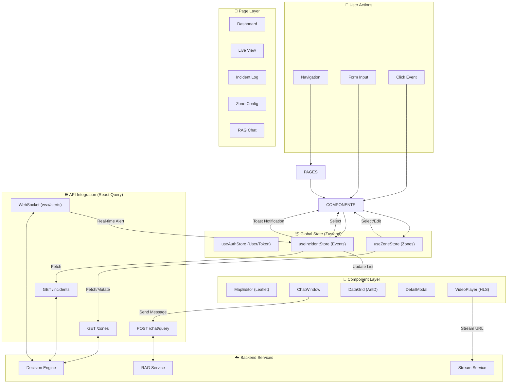

# ArgusV — UI Implementation Deep Dive & Plan

> **Component:** Frontend Architecture (MVP)  
> **Framework:** React 18 + Vite + Tailwind CSS + Ant Design  
> **Date:** February 14, 2026

---

## 1. UI Philosophy & Agentic Compatibility

This UI is designed to be **modular**, **state-driven**, and **component-first**. This structure allows AI agents to build individual components in isolation without breaking the broader application.

### Key Principles for Agentic Development
1.  **Strict Separation of Concerns**: 
    - `components/` = Pure UI (rendering props).
    - `hooks/` = Logic & API calls.
    - `stores/` = Global state (Zustand).
    - `pages/` = Layout composition.
2.  **Mock-First Development**: Every feature (e.g., Incident List) must work with a `mockData.ts` file before being connected to the real API. This allows UI perfection before backend integration.
3.  **Atomic Design**: Small, reusable atoms (Buttons, Badges) build into molecules (IncidentCard) which build into organisms (IncidentList).

---

## 2. Tech Stack & Libraries

| Category | Technology | Rationale |
|:---|:---|:---|
| **Core** | React 18, Vite, TypeScript | Standard, fast, type-safe. |
| **Styling** | Tailwind CSS + Ant Design 5 | Tailwind for layout/spacing; AntD for complex components (Tables, Forms, Modals). |
| **State** | Zustand | Simple, boilerplate-free global state management. |
| **Data Fetching** | TanStack Query (React Query) | Handles caching, loading states, and retries automatically. |
| **Routing** | React Router v6 | Standard client-side routing. |
| **Maps** | Leaflet.js (+ React Leaflet) | Lightweight, perfect for drawing zone polygons. |
| **Video** | Video.js (+ HLS.js) | Reliable streaming of HLS feeds from the backend. |
| **Charts** | Recharts | Composable, React-native charting library. |
| **Icons** | Lucide React | Clean, modern SVG icons. |

---

## 3. Global Application State (Zustand Stores)

We will define three primary stores to manage the application state.

### 3.1 `useAuthStore`
- **State**: `user` (User object), `token` (JWT string), `isAuthenticated` (bool).
- **Actions**: `login(credentials)`, `logout()`.
- **Persistence**: `localStorage` (for token).

### 3.2 `useZoneStore`
- **State**: `zones` (List of Zone objects), `selectedZone` (Zone | null), `isEditing` (bool).
- **Actions**: `fetchZones()`, `addZone(zone)`, `updateZone(id, data)`, `deleteZone(id)`.

### 3.3 `useIncidentStore`
- **State**: `incidents` (List), `stats` (Summary object), `liveEvents` (Queue of real-time events).
- **Actions**: `fetchIncidents(filters)`, `addRealtimeEvent(event)`, `markAsRead(id)`.

---

## 4. Component Architecture Deep Dive

### 4.1 Layout Shell (`components/layout/`)

The application wrapper ensuring consistent navigation and branding.

-   **`MainLayout.tsx`**:
    -   **Sidebar**: Collapsible. Navigation links: Dashboard, Live View, Incidents, Zones, Settings.
    -   **Header**: Breadcrumbs, User Profile dropdown, **Global Alert Bell** (shows unseen high-severity incidents).
    -   **Content Area**: Renders `<Outlet />` with a standard padding and background.

### 4.2 Dashboard (`pages/Dashboard.tsx`)

High-level overview for the security manager.

-   **`StatsGrid`**: 4 cards displaying:
    -   active cameras (green/red status indicator)
    -   today's total incidents
    -   avg. response time
    -   active zones.
-   **`IncidentTrendChart`**: Line chart (Recharts) showing incidents over the last 24h.
-   **`RecentActivityList`**: Simplified table of the last 5 events (Time, Zone, Type, Severity).

### 4.3 Live View (`pages/LiveView.tsx`)

The operational center for real-time monitoring.

-   **`CameraGrid`**: CSS Grid layout (1x1, 2x2, or customized) rendering `VideoPlayer` components.
-   **`VideoPlayer`**:
    -   Accepts `streamUrl` (HLS) and `posterUrl`.
    -   Overlays: Zone polygons (semitransparent red/green), Object Bounding Boxes (if metadata available).
    -   Controls: Mute, Fullscreen, "Snapshot" button.
-   **`LiveFeedSidebar`** (Right panel):
    -   Auto-scrolling list of incoming events via WebSocket.
    -   Clicking an event highlights the relevant camera.

### 4.4 Zone Configuration (`pages/Zones.tsx`)

Map-centric interface for defining security policies.

-   **`ZoneListSidebar`**: List of existing zones with toggle switches (Active/Inactive).
-   **`MapEditor`** (The "Canvas"):
    -   **Mode A: Snapshot (Default)**: Fetches a static execution from `GET /api/cameras/:id/snapshot`. This is preferred for drawing polygons as the image is stable.
    -   **Mode B: Live Feed**: Renders the HLS stream (`VideoPlayer`) underneath the SVG drawing layer. Useful for verification.
    -   **Drawing Tools**: "Draw Polygon", "Edit Points", "Delete".
    -   **Technical Implementation**:
        -   The `VideoPlayer` or `img` tag sits at `z-index: 0`.
        -   An SVG layer (`<svg>`) sits at `z-index: 10` matching the exact aspect ratio.
        -   Leaflet.js is used with `L.imageOverlay` to map pixel coordinates to "geo" coordinates (0,0 to 100,100) so polygons scale correctly if resolution changes.
-   **`RuleConfigForm`**:
    -   Appears when a zone is selected.
    -   Inputs: Name, Type (Restricted/Public), Time Window (Start/End), Dwell Threshold (slider), Severity (Low/Medium/High).
    -   **Action Cascades**: Checkboxes for "Voice Down", "Floodlight", "Slack Alert", "Lockdown".

### 4.5 Incidents & Investigation (`pages/Incidents.tsx`)

Detailed log with evidence and RAG integration.

-   **`IncidentTable`**: Sortable, filterable (Date Range, Zone, Severity).
-   **`IncidentDetailModal`**:
    -   **Header**: ID, Timestamp, Severity Badge.
    -   **Media**: Video clip player + Key frame carousel.
    -   **VLM Analysis**: Text block showing the AI's reasoning ("Person detected loitering...").
    -   **Chat Tab (RAG)**: "Ask about this incident" button pre-fills the chat context.

### 4.6 RAG Chat Interface (`components/features/Chat.tsx`)

A floating or dedicated panel for natural language queries.

-   **`ChatWindow`**:
    -   **MessageList**: Renders User (right) and AI (left) bubbles. AI bubbles support Markdown (bolding, lists).
    -   **IncidentCardEmbed**: If the AI cites an incident, render a mini-card inside the chat that links to the details.
    -   **InputArea**: Text input + "Send" button.
-   **Integration**:
    -   sends POST to `/api/chat/query`.
    -   receives streaming text response.

---

## 5. Integration Strategy

All API communication is centralized in `src/api/`.

-   **`api/client.ts`**: Axios instance with `baseURL` from env, request interceptor for JWT injection.
-   **`api/incidents.ts`**: `getIncidents`, `getIncidentDetails`, `updateIncidentStatus`.
-   **`api/zones.ts`**: `getZones`, `createZone`, `updateZone`.
-   **`hooks/useSocket.ts`**:
    -   Connects to `ws://api.argusv.com/ws/alerts`.
    -   On message: Updates `useIncidentStore`, triggers a toast notification (if high severity).

---

## 6. Implementation Roadmap (UI Specific)

### Phase 1: Skeleton & Design System (Days 1-3)
1.  Initialize Vite project with TypeScript.
2.  Setup Tailwind & Ant Design theme (Dark Mode priority).
3.  Build `MainLayout` and navigation.
4.  Create global stores (Zustand).

### Phase 2: Core Components (Days 4-7)
1.  **Dashboard**: Stats cards and charts with mock data.
2.  **Incidents**: Table and Detail modal with dummy video assets.
3.  **Zones**: Integration of Leaflet.js on top of local images (coordinate mapping).

### Phase 3: Integration & Live View (Days 8-12)
1.  **Live View**: Implement `Video.js` HLS player.
2.  **API Integration**: Replace mock data hooks with React Query + Axios.
3.  **Real-time**: Connect WebSocket for live alert toasts.

### Phase 4: RAG & Polish (Day 13-15)
1.  Build Chat interface.
2.  Connect to `rag-chat-service`.
3.  Error handling (Toast notifications on API failure).
4.  Responsive design tweaks.

---

## 7. Folder Structure

```
src/
├── api/             # API client & endpoint definitions
├── assets/          # Static images, fonts
├── components/
│   ├── common/      # Buttons, Badges, Cards (UI Atoms)
│   ├── features/    # Business logic components (e.g., ZoneEditor)
│   ├── layout/      # Sidebar, Header
│   └── overlays/    # Modals, Drawers
├── hooks/           # Custom React hooks (useIncidents, useSocket)
├── pages/           # Route views (Dashboard, Incidents)
├── stores/          # Zustand state definitions
├── types/           # TypeScript interfaces (Incident, Zone)
├── utils/           # Formatters, helpers
└── App.tsx          # Router definition
```

---

*This document serves as the "Blueprints" for the UI agents. Each component section above can be fed into an agent as a specific task prompt.*

---

## 8. UI Architecture Flow Diagram


